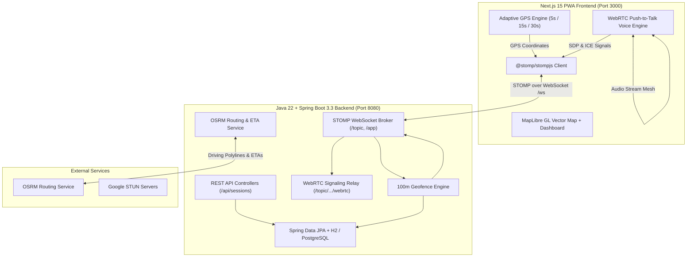

# 🗺️ SquadMap V2 — Real-Time Group Location, Driving ETAs & WebRTC Voice Walkie-Talkie

> **Coordinate road trips, track live squad positions with GPU vector maps, get dynamic driving ETAs, and speak over push-to-talk voice — with zero account required.**

---

## 🌟 What's New in V2

SquadMap V2 is a complete modern re-architecture designed for performance, sleek road-trip UX, and high concurrency:

1. **🗺️ Smooth Vector Maps (MapLibre GL)**:
   - GPU-accelerated WebGL vector map rendering replacing Leaflet.
   - 3D road trip tilt perspective (35° pitch) with smooth bearing rotation following driving direction.
   - Glowing OSRM driving polylines showing exact highway and road paths to the destination.
   - Dynamic member avatars with speed badges and moving pulses.

2. **🎙️ WebRTC Voice Walkie-Talkie**:
   - Push-To-Talk (PTT) voice mesh for convoy drivers.
   - Hold down the PTT button or hit `[Spacebar]` to broadcast voice.
   - Glowing soundwave activity indicator showing who is speaking in real-time.
   - Zero third-party audio service fees; signaled peer-to-peer over STOMP WebSocket.

3. **🚗 OSRM Dynamic Driving Routes & ETAs**:
   - Live turn-by-turn road paths calculated via Open Source Routing Machine (OSRM).
   - Real-time arrival time countdowns and distance remaining for every squad member.
   - Resilient fallback driving model when offline or out of cell coverage.

4. **🔋 Battery-Aware Adaptive GPS Engine**:
   - Automatically adapts location update frequency based on movement speed:
     - **Driving (> 30 km/h)**: High precision updates every **5 seconds**.
     - **Moving (5–30 km/h)**: Balanced updates every **15 seconds**.
     - **Stationary (< 5 km/h)**: Battery-saver mode every **30 seconds**.
   - Built-in **Drive Simulator** for instant desktop testing and road-trip demonstration without moving a car.
   - 1-tap Privacy Pause button.

5. **🏁 100-Meter Geofence Arrival Detection**:
   - Backend evaluates participant proximity to destination pin.
   - Crossing the 100m geofence automatically marks the user arrived, triggers room-wide arrival notices, and fires confetti celebrations.

6. **💬 Road-Trip Squad Chat & QR Onboarding**:
   - Quick-reply chips (*"On my way! 🚗"*, *"Almost there 🏁"*, *"Pit stop ⛽"*, *"I'm here! 🎉"*).
   - 6-character room codes and high-res QR codes for instant mobile camera scanning in vehicles.

---

## 🏗️ Architecture Overview



---

## 🛠️ Tech Stack

| Tier | Technology | Purpose |
| :--- | :--- | :--- |
| **Backend Framework** | Java 22 & Spring Boot 3.3.4 | High-throughput concurrent backend |
| **Real-Time Engine** | Spring WebSocket + STOMP + SockJS | Sub-second event broadcast & WebRTC signaling |
| **Persistence** | Spring Data JPA + Hibernate | Ephemeral session & participant management |
| **Database** | Embedded H2 (Dev) / PostgreSQL 16 (Prod) | Zero-setup local dev with production scale |
| **Frontend Framework** | Next.js 15, React 19, TypeScript | Server and Client App Router PWA |
| **Map Engine** | MapLibre GL JS | GPU-accelerated vector map, 3D tilt, dark mode |
| **Voice Channel** | WebRTC Audio + Push-To-Talk | In-car handsfree convoy walkie-talkie |
| **Routing** | OSRM (Open Source Routing Machine) | Driving polylines, traffic durations & distances |
| **Styling** | Tailwind CSS + Lucide Icons | Dark glassmorphic mobile-first road UI |

---

## 🚀 Quick Start Guide

### Prerequisites
* **Java 21 or 22** (`java -version`)
* **Node.js 18+** (`node -v`) and **Bun** (or `npm`)

---

### Step 1: Start the Java 22 Spring Boot Backend
In a terminal at the project root:

```powershell
# Using the bundled Maven wrapper:
.\backend\mvnw.cmd -f backend\pom.xml spring-boot:run

# Or via npm script:
npm run dev:backend
```

* Backend runs on **`http://localhost:8080`**
* H2 Database Console: **`http://localhost:8080/h2-console`** (JDBC URL: `jdbc:h2:mem:squadmapdb`)
* WebSocket STOMP endpoint: **`http://localhost:8080/ws`**

---

### Step 2: Start the Next.js 15 Frontend
In a second terminal:

```powershell
# Using Bun (fastest):
cd frontend
bun run dev

# Or using npm:
npm run dev:frontend
```

* Frontend opens on **`http://localhost:3000`**

---

### Step 3: Run Backend Tests
To verify all session creation, join logic, arrival geofence detection, and WebSocket configs:

```powershell
.\backend\mvnw.cmd -f backend\pom.xml test
```

---

## 📡 API & STOMP WebSocket Reference

### REST Endpoints (`/api/sessions`)

| Method | Endpoint | Description |
| :--- | :--- | :--- |
| `POST` | `/api/sessions` | Create a new trip session `{ name, hostDisplayName, destinationName, destinationLat, destinationLng }` |
| `GET` | `/api/sessions/{code}` | Retrieve session details, destination, and active squad members |
| `POST` | `/api/sessions/{code}/join` | Join trip room `{ displayName, colorHex }` |
| `PATCH` | `/api/sessions/{code}/destination` | Move destination pin `{ destinationName, destinationLat, destinationLng }` |
| `GET` | `/api/sessions/{code}/eta` | Fetch live sorted squad ETAs, distances, and OSRM route polylines |
| `GET` | `/api/sessions/{code}/chat` | Retrieve recent chat messages |
| `POST` | `/api/sessions/{code}/chat` | Send road-trip chat message |
| `DELETE` | `/api/sessions/{code}` | End trip session early |

### STOMP WebSocket Channels

#### Client Publish Destinations (`/app`)
* `/app/location.update`: Publish GPS location `{ sessionCode, userId, lat, lng, speed, heading, isPaused }`
* `/app/location.pause`: Toggle privacy pause `{ sessionCode, userId, isPaused }`
* `/app/chat.send`: Send in-trip chat message `{ sessionCode, senderId, senderName, text, isQuickReply }`
* `/app/session.join`: Announce presence `{ sessionCode, userId, displayName, colorHex }`
* `/app/webrtc.signal`: Relay Push-To-Talk voice signals `{ sessionCode, type, senderId, targetId, payload }`

#### Client Subscribe Topics (`/topic`)
* `/topic/session/{code}/location`: Live GPS positions of all members
* `/topic/session/{code}/eta`: Live driving ETAs and distances (refreshed every 30s)
* `/topic/session/{code}/chat`: In-app squad road chat
* `/topic/session/{code}/presence`: Squad member join / leave events
* `/topic/session/{code}/destination`: Destination pin updates
* `/topic/session/{code}/arrived`: 100m geofence arrival announcements
* `/topic/session/{code}/system`: Session expiration (12h TTL) and termination notices
* `/topic/session/{code}/webrtc`: WebRTC peer voice audio signaling

---

## 📄 License
MIT License. Free and open source for road trips, convoys, and groups!
